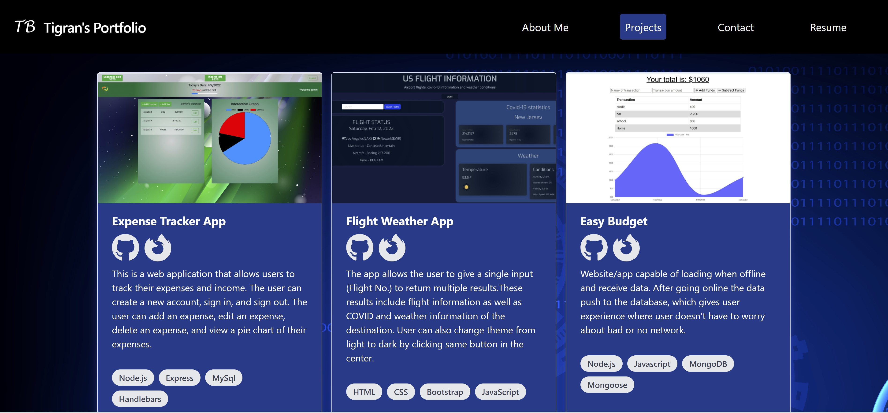

# Tigran Balayan's Portfolio

## Demonstration Screenshots

## Purpose

Portfolio webpage showcases Tigran's projects, has about me section, resume with detailed fullstack developer skills and contact me section with input fields.

## Built With

- 
- 
- 
- 

## Deployed link

https://tigranbalayan10.github.io/portfolio-spa/

## GitHub Repository Link

https://github.com/TigranBalayan10/portfolio-spa

## Contribution

Made by Tigran Balayan
